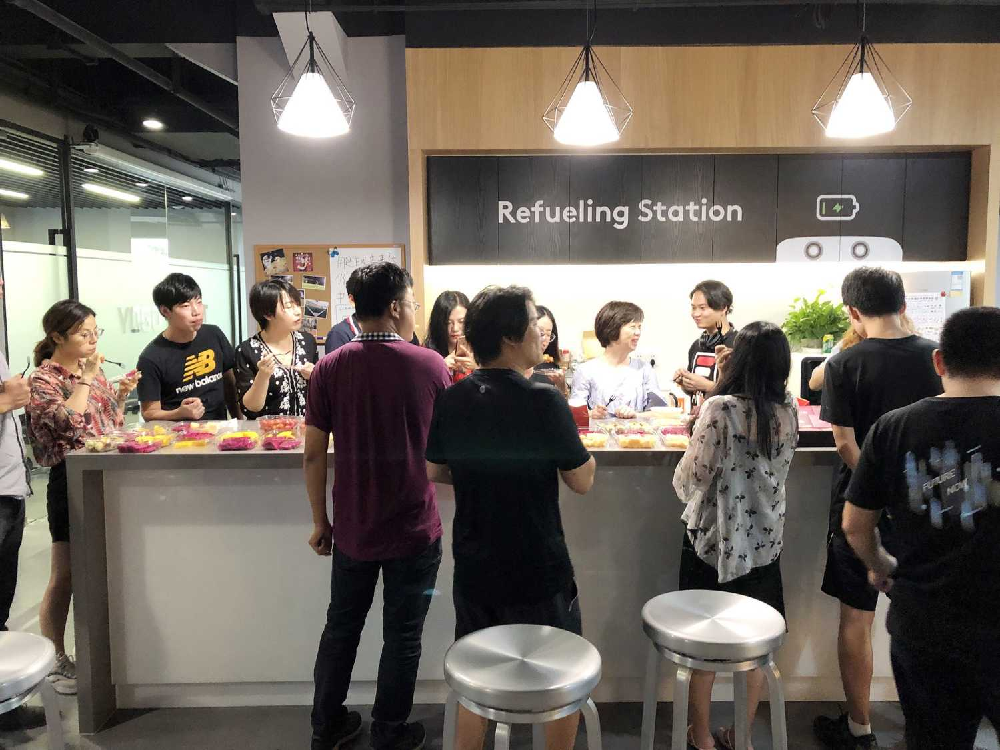

YOGO ROBOT Hire
===============

> 校招请移步这里 → → https://mp.weixin.qq.com/s/R6FBIIGPpGQdiPkXAdFZ_g

### 01 我们是谁？

[YOGO ROBOT - 上海有个机器人有限公司](https://www.yogorobot.com/)，用机器人技术改变未来物质传递方式。

#### 我们做什么

创造一个新物种 — 机器人

楼宇内不知疲倦的跑腿好帮手

还可以是一个激萌帅气的小小服务员～

### 02 我们提供

在这里，你将定义机器人和它们的行为准则

在这里，你将感受到多个学科领域的技术碰撞

在这里，从0到1解决机器人群体决策、无人驾驶、云应用探索的难题，真正获得指数级成长曲线

我们鼓励谈梦想，也鼓励谈钱，薪资、晋升不用担心～

每周一次集体运动，踢足球、羽毛球、滑板社～

入职即享10天带薪年假

每年一次户外未知之旅，攀登高峰，穿越沙漠...

还有书籍基金，额外商保，日常撸机器人 ^_^

### 03 云应用方向社招 — 看这里 ↓↓↓

你将参与到机器人云应用的产品设计、架构设计和代码实现。

#### 云应用 — 前端研发工程师 / 架构师

具备扎实的前端知识基础

熟悉Vue、React等常用开发框架

熟悉基本的数据结构和算法

具有良好的编码风格和测试习惯

自我驱动和强烈的责任心

薪资 20-40K

#### 云应用 — 后端研发工程师 / 架构师

3年以上 Python / Go 工作经验

熟练使用 Linux / SQL / GIT

熟悉基本数据结构和算法

熟悉基本的分布式架构设计

良好的编码风格和测试习惯

自我驱动和强烈的责任心

薪资 20- 40k

工作地点： 上海 汶水路地铁站 宏慧视界

#### 加分项

* Github 有开源项目超过 100 star， 或给大型项目贡献过代码
* 写技术博客（或者微信公众号、知乎专栏等），请把链接放在简历上

如果有 Stars 超过 500 的 前端 / Python / Golang 项目，我们直接聊聊吧！

### 联系

[wangchao@yogorobot.com](mailto:wangchao@yogorobot.com)
[hit9@icloud.com](mailto:hit9@icloud.com)

### 04 全YOGO的人都在等你的简历..

