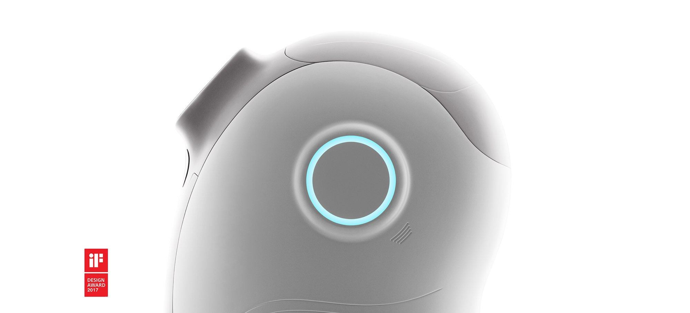
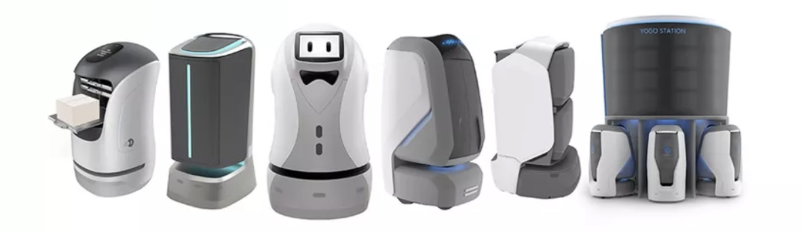
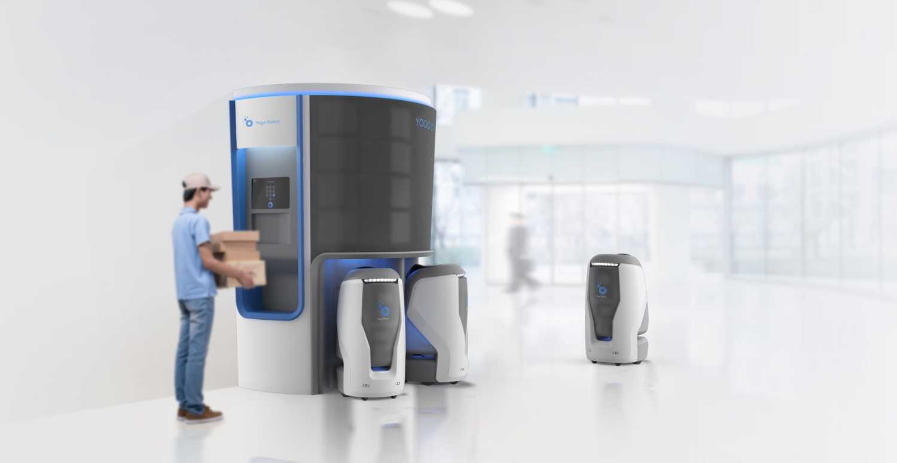
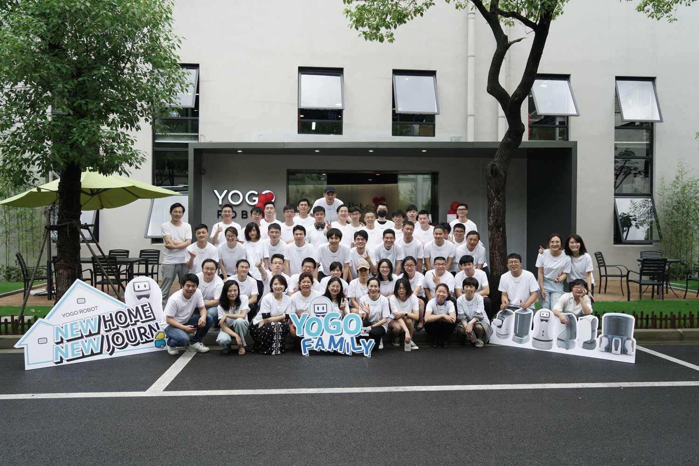
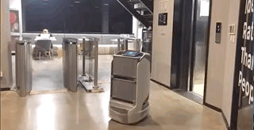

YOGO ROBOT Hire
===============

> 校招请移步这里 → → https://mp.weixin.qq.com/s/R6FBIIGPpGQdiPkXAdFZ_g

### 01 我们是谁？

[YOGO ROBOT - 上海有个机器人有限公司](https://www.yogorobot.com/)，用机器人技术改变未来物质传递方式。

#### 我们做什么

创造一个新物种 — 机器人

楼宇内不知疲倦的跑腿好帮手

还可以是一个激萌帅气的小小服务员～

### 02 我们提供

在这里，你将定义机器人和它们的行为准则

在这里，你将感受到多个学科领域的技术碰撞

在这里，从0到1解决机器人群体决策、无人驾驶、云应用探索的难题，真正获得指数级成长曲线

我们鼓励谈梦想，也鼓励谈钱，薪资、晋升不用担心～

每周一次集体运动，踢足球、羽毛球、滑板社～

入职即享10天带薪年假

每年一次户外未知之旅，攀登高峰，穿越沙漠...

还有书籍基金，额外商保，日常撸机器人 ^_^

### 03 云应用方向社招 — 看这里 ↓↓↓

工作地点： 上海 汶水路地铁站 宏慧视界

#### 云应用 — 前端研发工程师 / 架构师

**在这个岗位你将会**:

* 参与有个机器人公司应用软件产品的前端架构设计和代码实现。
* 基于前所未有的硬件平台，和机器人软硬件工程师一起，打造全新的产品交互和业务逻辑。
* 和后端开发及硬件工程师协同，打造软硬件结合的完整和谐的机器人新物种。

** 我们期望你**:

* 具备3年以上的前端研发经验
* 扎实的前端知识基础
* 熟悉Vue、React等常用开发框架
* 熟悉基本的数据结构和算法
* 具有良好的编码风格和测试习惯
* 自我驱动和强烈的责任心

**加分项**:

* React Native / Electron / 微信小程序 等开发经验
* 熟悉前端性能优化。
* Github 有开源的前端项目超过 100 star， 或给大型项目贡献过代码
* 写技术博客（或者微信公众号、知乎专栏等），请把链接放在简历上

薪资 20-40K

#### 云应用 — 后端研发工程师 / 架构师

* 参与机器人应用软件产品的后端架构设计和代码实现。
* 基于前所未有的硬件平台，和机器人软硬件工程师一起，打造全新的产品交互和业务逻辑。
* 从 0 到 1 构建完整的行业应用，负责后端业务分析和功能开发，对业务完成分析、设计、架构、研发并把控最终质量。

** 我们期望你**:

* 具备3年以上 Python / Go 工作经验
* 熟练使用 Linux / SQL / GIT
* 熟悉基本数据结构和算法
* 良好的编码风格和测试习惯
* 自我驱动和强烈的责任心

**加分项**:

* 参与过复杂后台系统或分布式系统的架构设计和研发
* Github 有开源的前端项目超过 100 star， 或给大型项目贡献过代码
* 写技术博客（或者微信公众号、知乎专栏等），请把链接放在简历上

薪资 20-40K

**如果有 Stars 超过 500 的 前端 / Python / Golang 项目，我们直接聊聊吧！**

#### 联系

* [wangchao@yogorobot.com](mailto:wangchao@yogorobot.com)
* [qinting@yogorobot.com](mailto:qinting@yogorobot.com)

### 04 全YOGO的人都在等你的简历..

#### 文末彩蛋

